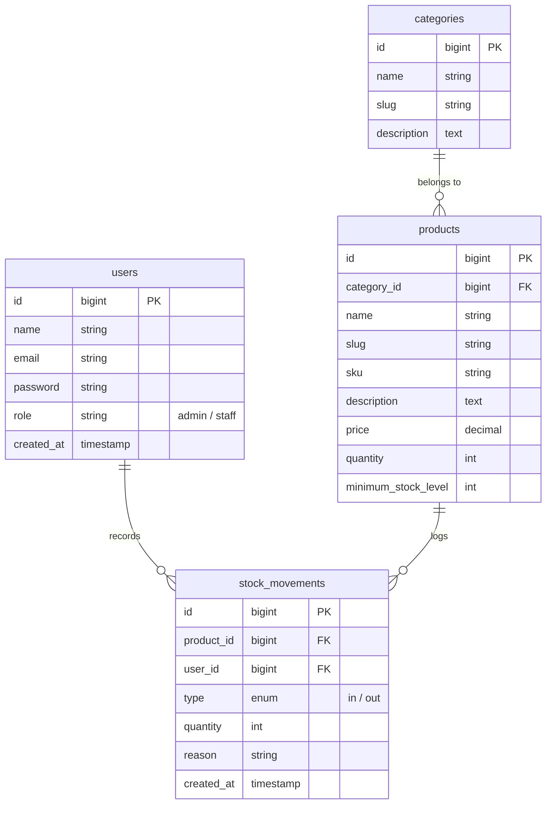

# 📦 Inventory Management System Backend (Laravel 13)

A robust, enterprise-ready RESTful API backend for inventory tracking, category organization, stock audit logging, and automated safety stock level alerting. Built with Laravel 13, MySQL, and Sanctum.

---

## 🚀 Learning & Architectural Highlights

- **RESTful API Versioning**: Versioned under `/api/v1/` to ensure modularity and backward compatibility.
- **Service/Repository Pattern**: Business logic for stock calculations is isolated in `StockService` to keep controllers thin.
- **Database Transactions**: All stock movements run inside a database transaction with table row locks (`lockForUpdate()`) to prevent race conditions during concurrent stock updates.
- **Role-Based Access Control (RBAC)**: Integrated using Laravel Policies to enforce read/write bounds (Admins can perform CRUD; Staff can view inventory and log stock movements).
- **Automated Testing**: Comprehensive suite using **Pest PHP** verifying authentication, access control, and transaction safety.

---

## 🛠️ Installation & Setup

### Prerequisites
- PHP 8.2 or higher (with `mbstring`, `pdo_mysql`, `openssl`, `zip`, `curl` extensions enabled)
- Composer 2.x
- Node.js & npm (for bundling assets)
- MySQL Server

### Step-by-Step Local Deployment

1. **Clone & Navigate** to the project directory:
   ```bash
   cd inventory
   ```

2. **Install Dependencies**:
   ```bash
   composer install
   ```

3. **Environment Configuration**:
   Copy `.env.example` to `.env` and configure your database settings:
   ```bash
   cp .env.example .env
   ```
   *Make sure to update the `DB_DATABASE`, `DB_USERNAME`, and `DB_PASSWORD` variables to match your local MySQL configuration.*

4. **Generate Application Key**:
   ```bash
   php artisan key:generate
   ```

5. **Run Migrations & Seeders**:
   This creates the database tables and populates users, categories, products, and initial audit logs:
   ```bash
   php artisan migrate:refresh --seed
   ```

6. **Compile Frontend Assets**:
   ```bash
   npm run build
   ```

7. **Start the Server**:
   ```bash
   php artisan serve
   ```
   The backend will now be available at `http://127.0.0.1:8000`.

---

## 👥 Seeding / Default Credentials

The database seeder configures the following demo accounts for testing:

| User Role | Email | Password | Allowed Operations |
|---|---|---|---|
| **Admin** | `admin@example.com` | `password` | Full CRUD on Categories, Products, and Stock Movements. Access to reports. |
| **Staff** | `staff@example.com` | `password` | Read-only Categories/Products. Write Stock Movements. Access to reports. |

---

## 📊 Database Schema Relationships



---

## 📡 REST API Reference

All requests must supply the headers `Accept: application/json` and `Authorization: Bearer <your_token>`.

### Authentication
- `POST /api/v1/login` - Authenticates user credentials. Returns token.
- `POST /api/v1/logout` - Revokes current API token.
- `GET /api/v1/me` - Details of currently logged-in user.

### Categories
- `GET /api/v1/categories` - Fetch all categories.
- `POST /api/v1/categories` - Create new category (*Admin only*).
- `GET /api/v1/categories/{id}` - Fetch single category with nested products.
- `PUT /api/v1/categories/{id}` - Update category (*Admin only*).
- `DELETE /api/v1/categories/{id}` - Delete category (*Admin only*).

### Products
- `GET /api/v1/products` - List products (Paginated).
  - *Query filters*: `?category_id=1`, `?search=iphone` (matches SKU/name), `?low_stock=true`.
- `POST /api/v1/products` - Create a product (*Admin only*).
- `GET /api/v1/products/{id}` - Retrieve details and transaction history.
- `PUT /api/v1/products/{id}` - Update product (*Admin only*).
- `DELETE /api/v1/products/{id}` - Delete product (*Admin only*).

### Stock Movements
- `GET /api/v1/stock-movements` - View movements logs.
- `POST /api/v1/stock-movements` - Record a stock adjustment (*Staff & Admin*).
  - *Body fields*: `product_id`, `type` (`in`/`out`), `quantity` (min 1), `reason`.

### Reports
- `GET /api/v1/reports/low-stock` - Get list of products where quantity falls below minimum safety stock level.
- `GET /api/v1/reports/summary` - General metrics dashboard statistics.

---

## 🧪 Running Automated Tests

Run the test suite to execute the 8 feature tests verifying endpoints:
```bash
php artisan test
```

---

## 📝 Live Q&A Evaluation Prep

### Authentication & Authorization

**"Walk me through what happens when an unauthenticated user hits `GET /api/v1/products`."**
> The request enters Laravel's HTTP kernel → routed through the `api` middleware group → hits the `auth:sanctum` middleware → no `Authorization: Bearer` header is found → Sanctum throws an `AuthenticationException` → `bootstrap/app.php` has `shouldRenderJsonWhen(fn ($req) => $req->is('api/*'))` which returns the exception as a `401 Unauthenticated` JSON response instead of a redirect.

**"Why did you use a Policy instead of a Gate check inside the controller?"**
> Policies encapsulate authorization logic for a specific model in one reusable class. They keep controllers thin, allow reuse across multiple controllers/views, and make auditing security rules trivial — one file per model. Gates are for non-model checks. Using `Gate::authorize('create', Product::class)` in the controller is still calling the Policy behind the scenes.

**"What is the difference between authentication and authorization?"**
> Authentication = *who are you?* (verified by Sanctum token/session). Authorization = *what can you do?* (enforced by Policies using the user's `role` field). They are independent — a valid token authenticates you, but your role determines whether you can perform an action.

**"Why does the web login use a cookie/session while the API uses a Bearer token?"**
> Browsers automatically send cookies on every request (stateful), making session-based auth natural for web UIs. Mobile apps and external clients cannot rely on cookies, so they use stateless Bearer tokens. This project supports both via Breeze (web session) and Sanctum (token), running simultaneously without conflict.

**"What happens if a Staff user tries to `DELETE /api/v1/products/1`?"**
> Sanctum authenticates them via token (passes). Laravel resolves `ProductPolicy@delete($user, $product)`. The policy returns `false` because `$user->isAdmin()` is false for Staff. `Gate::authorize()` throws an `AuthorizationException`, which Laravel converts to a `403 Forbidden` JSON response.

---

### Database & Migrations

**"Why is `quantity` an integer and `price` a `decimal(10,2)`?"**
> Quantity is a whole number — you can't have 1.5 units. Price uses `decimal` (exact precision) instead of `float` (approximate) to avoid floating-point rounding errors in financial calculations. `(10,2)` allows up to 99,999,999.99.

**"Why does `stock_movements` use `cascadeOnDelete()` on `product_id`?"**
> When a product is deleted, its movement history becomes orphaned and meaningless. Cascade ensures referential integrity is maintained automatically. In a production system, you might instead use `SoftDeletes` on products to preserve the history — this is listed in Known Limitations.

**"Why is `type` an `enum('in','out')` instead of a string?"**
> An ENUM at the database level enforces the allowed values as a hard constraint — MySQL will reject any other value, preventing data corruption even if the application layer has a bug. It also documents the valid states clearly in the schema.

**"What happens if you run `migrate:rollback`?"**
> Laravel executes the `down()` method of each migration in reverse chronological order. For the indexes migration, it drops all 4 named indexes. For `create_stock_movements_table`, it drops the table. For `create_products_table`, it drops that table too. The migration history in the `migrations` table is also rolled back.

**"Why did you add indexes on `quantity` and `created_at`?"**
> `quantity` is used in the WHERE clause of every low-stock query (`quantity <= minimum_stock_level`). Without an index, MySQL does a full table scan. `created_at` on `stock_movements` is used for date-range filtering (e.g., `movements_today`). Indexes allow MySQL to use a B-tree lookup — O(log n) instead of O(n). The tradeoff is slightly slower INSERTs, which is acceptable since reads dominate in an inventory system.

---

### REST API Design

**"Why did you return `422` on stock overdraw instead of `400`?"**
> `400 Bad Request` = the request itself is malformed or structurally invalid. `422 Unprocessable Entity` = the request is well-formed and syntactically valid, but the business rule (insufficient stock) cannot be satisfied. Laravel's `ValidationException` maps to 422 by convention, which is semantically correct per RFC 9110.

**"How would you version this API for a v2 with a different response shape?"**
> Add a new `routes/api_v2.php` file (or a `v2` prefix group in `api.php`), create a new `App\Http\Controllers\Api\V2\` namespace with new controllers, and create new `ProductV2Resource` classes that reshape the JSON. The `v1` routes remain untouched — backward compatibility is preserved.

**"Why does `StockService` use `DB::transaction()` with `lockForUpdate()`?"**
> Without a transaction, two concurrent requests could both read `quantity = 10`, both decide "enough stock", and both subtract 5 — resulting in a final quantity of 5 instead of 0. `lockForUpdate()` adds a MySQL `SELECT ... FOR UPDATE` which blocks other transactions from reading the row until the current one commits, preventing this race condition.

**"What does `StockServiceInterface` give you that `StockService` alone doesn't?"**
> The interface defines a contract — what the service *does*, not *how* it does it. Controllers depend on the interface (abstraction), not the concrete class. This means we can swap `StockService` for a mock in tests, or replace it with a `WarehouseApiStockService` in production, by changing one line in `AppServiceProvider` — zero controller changes. This is the Dependency Inversion Principle (SOLID).

---

### Server Management

**"The app is throwing a stale config error after deployment — what do you check first?"**
> Run `php artisan config:clear` to delete the cached config. If routes are stale: `php artisan route:clear`. If views are cached: `php artisan view:clear`. For everything at once: `php artisan optimize:clear`. In production after every deploy, run `php artisan optimize` to rebuild fresh caches.

**"How do you check Laravel logs to diagnose a 500 error?"**
> Check `storage/logs/laravel.log`. The last entry will have the exception class, message, file, line number, and full stack trace. You can also run `php artisan tail` or use `LOG_LEVEL=debug` in `.env` for verbose output.

**"What is a queue worker and when would you need one here?"**
> A queue worker (`php artisan queue:work`) processes background jobs asynchronously. In this system, it would be needed for: sending low-stock email alerts (don't block the HTTP request), generating large CSV reports, or firing webhooks on stock changes. Currently the `QUEUE_CONNECTION=database` is configured — jobs would be stored in the `jobs` table and processed by the worker.


---

## ⚠️ Known Limitations

The following features are intentionally out of scope or deferred for future development:

| Limitation | Notes |
|---|---|
| **No soft deletes** | Products and categories are hard-deleted. In production, `SoftDeletes` should be used to retain audit history. |
| **No product image uploads** | Product records are text-only. A file storage integration (e.g. S3) would be needed for images. |
| **No email notifications** | No alerts are sent when stock falls below minimum level. A queued job/notification would handle this in production. |
| **No pagination on reports** | `/api/v1/reports/low-stock` returns all low-stock products at once — no pagination limit. |
| **Role enum not enforced at DB level** | The `role` column is a plain string, not a MySQL ENUM. Could cause data inconsistency without application-level validation. |
| **No API rate limiting** | The public `/api/v1/login` endpoint has no throttle middleware beyond Laravel's default `60/min`. |
| **Single guard setup** | Currently uses Sanctum for API and Breeze session for web. Multi-tenancy or OAuth2 would require a more advanced setup. |
